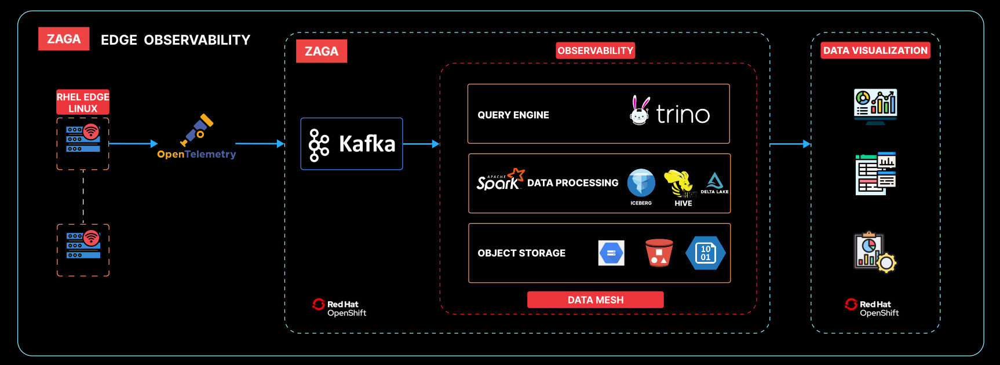

# Industrial Transformation Asia-Pacific Expo

##

The demo provided is tested with

| RHEL for Edge Version(s) | MicroShift Version | MicroShift Release Status |
|--------------------------|--------------------|---------------------------|
| 9.4                      | 4.16               | Generally Available        |

1. To create RHDE with microshift boot ISO file. [click here](01-rhel-edge-microshift-iso-builder/README.md)

2. To setup kepler on microshift. [click here](02-edge-device-kepler/README.md)

3. To setup collector on microshift. [click here](03-edge-device-opentelemetry-collector/README.md)

***Setting up static IP***

In kickstart file network settings is set to dhcp. Plugin the ethernet cable and check the IP address using CLI.
To set static IP after OS is installed, use following commands.

```shell
nmcli conn show
```

```shell
nmcli conn mod <con-name> ipv4.method manual ipv4.add (static-IPaddress)/24 ipv4.dns 8.8.8.8,(additional-dns-if-required) ipv4.gateway (gateway-address)
```

***Setting up ArgoCD core in miccroshift for gitops, Run the following commands.***

```shell
oc create namespace argocd
```

```shell
oc apply -n argocd -f https://raw.githubusercontent.com/argoproj/argo-cd/v2.12.4/manifests/core-install.yaml
```

```shell
oc config use-context microshift
oc config set-context --current --namespace=argocd
```

```shell
argocd login --core
```

```shell
argocd admin dashboard -n argocd
```

***The following resources will be created for argocd core.***

```shell
customresourcedefinition.apiextensions.k8s.io/applications.argoproj.io created
customresourcedefinition.apiextensions.k8s.io/applicationsets.argoproj.io created
customresourcedefinition.apiextensions.k8s.io/appprojects.argoproj.io created

serviceaccount/argocd-application-controller created
serviceaccount/argocd-applicationset-controller created
serviceaccount/argocd-redis created
serviceaccount/argocd-repo-server created

role.rbac.authorization.k8s.io/argocd-application-controller created
role.rbac.authorization.k8s.io/argocd-applicationset-controller created
role.rbac.authorization.k8s.io/argocd-redis created

clusterrole.rbac.authorization.k8s.io/argocd-application-controller created

rolebinding.rbac.authorization.k8s.io/argocd-application-controller created
rolebinding.rbac.authorization.k8s.io/argocd-applicationset-controller created
rolebinding.rbac.authorization.k8s.io/argocd-redis created

clusterrolebinding.rbac.authorization.k8s.io/argocd-application-controller created

configmap/argocd-cm created
configmap/argocd-cmd-params-cm created
configmap/argocd-gpg-keys-cm created
configmap/argocd-rbac-cm created
configmap/argocd-ssh-known-hosts-cm created
configmap/argocd-tls-certs-cm created

secret/argocd-secret created

service/argocd-applicationset-controller created
service/argocd-metrics created
service/argocd-redis created
service/argocd-repo-server created

deployment.apps/argocd-applicationset-controller created
deployment.apps/argocd-redis created
deployment.apps/argocd-repo-server created

statefulset.apps/argocd-application-controller created

networkpolicy.networking.k8s.io/argocd-application-controller-network-policy created
networkpolicy.networking.k8s.io/argocd-applicationset-controller-network-policy created
networkpolicy.networking.k8s.io/argocd-redis-network-policy created
networkpolicy.networking.k8s.io/argocd-repo-server-network-policy created
```

### Edge Observability


